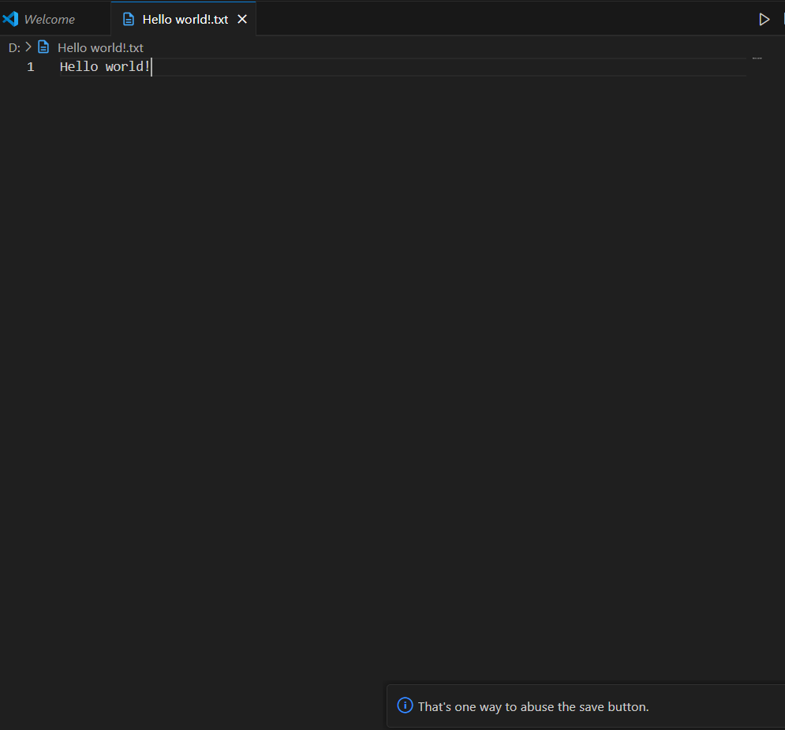

# Code Roast

Every time you save a file, Code Roast gives you a sarcastic comment about your code quality.

## Features

- Hilarious roasts after every save
- Configurable enable/disable toggle

## Usage

1. Install the extension
2. Save any file
3. Enjoy your roast

## Settings

- `codeRoast.enableRoast`: Enable or disable roast messages (default: true)

## Screenshots

## License

MIT
